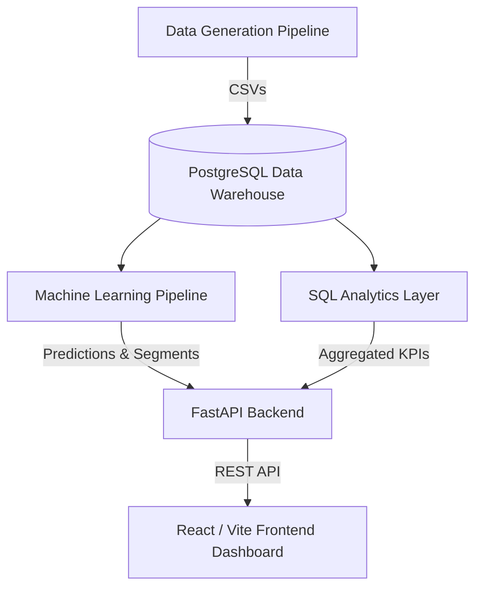

# System Architecture: E-Commerce Intelligence System

## 1. High-Level Architecture
The system is built on a modern, decoupled architecture separating data engineering, backend analytics, and frontend presentation.

## 2. Components
### Data Generation & Engineering (Python)
- **Role**: Simulates a live production e-commerce database. Generates millions of rows maintaining strict referential integrity (e.g., total order amount equals the sum of order items minus discounts).
- **Libraries**: `pandas`, `numpy`, `faker`

### Data Warehouse (PostgreSQL)
- **Role**: Serves as the central repository for all structured data.
- **Design**: Star-schema inspired relational design. Optimized with indexing on highly queried columns (`customer_id`, `order_date`).

### Machine Learning Layer (Python)
- **Role**: Derives predictive insights from historical data.
- **Models**:
  - **Segmentation**: K-Means clustering (Scikit-learn) combined with RFM rules.
  - **Churn**: Random Forest Classifier evaluating past purchasing frequency and monetary metrics.
  - **Forecasting**: ARIMA model (`statsmodels`) projecting revenue trends.

### Backend API (FastAPI)
- **Role**: Intermediary layer between the DB/ML output and the frontend.
- **Features**: Highly concurrent REST endpoints. Implements a rule-based Business Insight Engine that flags anomalies based on API thresholds.

### Frontend Dashboard (React)
- **Role**: User-facing BI tool.
- **Tech**: Vite (bundling), Tailwind CSS (styling), Recharts (data visualization), React Router (navigation).
